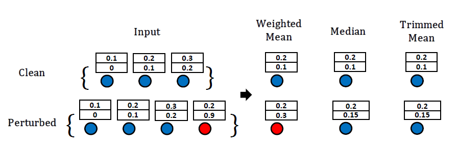

# MedianGCN
Official PyTorch implementation of MedianGCN and TrimmedGCN in **Understanding Structural Vulnerability in Graph Convolutional Networks** (IJCAI 2021).

[[Paper]](https://www.ijcai.org/proceedings/2021/310) | [[Poster]](./poster.pdf) | [[Slides]](./slides.pdf)


<p align="center">  <p align="center"><em>Fig. 1.  A simple example of the weighted mean, median, and trimmed mean aggregation. The median and trimmed mean achieve the best robustness performance compared to state-of-the-art models without sacrificing predictive accuracy.</em></p>

Recent studies have shown that Graph Convolutional Networks (GCNs) are vulnerable to adversarial attacks on the graph structure. Although multiple works have been proposed to improve their robustness against such structural adversarial attacks, the reasons for the success of the attacks remain unclear. In this work, we theoretically and empirically demonstrate that structural adversarial examples can be attributed to the non-robust aggregation scheme (i.e., the weighted mean) of GCNs. Specifically, our analysis takes advantage of the breakdown point which can quantitatively measure the robustness of aggregation schemes. The key insight is that weighted mean, as the basic design of GCNs, has a low breakdown point and its output can be dramatically changed by injecting a single edge. We show that adopting the aggregation scheme with a high breakdown point (e.g., median or trimmed mean) could significantly enhance the robustness of GCNs against structural attacks. Extensive experiments on four real-world datasets demonstrate that such a simple but effective method achieves the best robustness performance compared to state-of-the-art models.


These models are now also available our Pytorch-based repository [GraphGallery](https://github.com/EdisonLeeeee/GraphGallery), see:
+ `graphgallery.gallery.nodeclas.MedianGCN`
+ `graphgallery.gallery.nodeclas.TrimmedGCN`

## Requirements

+ torch>=1.4.0
+ graphgallery
```bash
git clone https://github.com/EdisonLeeeee/GraphGallery.git && cd GraphGallery
pip install -e . --verbose
```

## Usage
+ Performance of our methods compared to GCN before attack (on clean graph):
see `clean.ipynb`
+ Performance our methods compared to GCN under Nettack attack (on purtubed graph):
see `attack.ipynb`

# Example (with DGL or PyG)
The median and trimmed aggregation were initially implemented with pure PyTorch, which are much slower and require higher computation overhead. Here we provide DGL and PyG implementation of Median Convolution (`MedianConv`) for convenience, which also leads to a smaller computation overhead:

+ PyTorch Geometric (PyG)

```python
>>> import torch
>>> from median_pyg import MedianConv

>>> edge_index = torch.as_tensor([[0, 1, 2], [2, 0, 1]])
>>> x = torch.randn(3, 5)
>>> conv = MedianConv(5, 2)
>>> conv(x, edge_index)
tensor([[-0.5138, -1.3301],
        [-0.5138,  0.1693],
        [ 0.2367, -1.3301]], grad_fn=<AddBackward0>)
```

+ Deep Graph Library (DGL)

```python
>>> import dgl
>>> import torch
>>> from median_dgl import MedianConv

>>> g = dgl.graph(([0, 1, 2], [2, 0, 1]))
>>> x = torch.randn(3, 5)
>>> conv = MedianConv(5, 2)
>>> conv(g, x)
tensor([[-0.8558,  0.9913],
        [ 0.1039, -0.1196],
        [ 0.2629,  0.0969]], grad_fn=<AddBackward0>)
```


# Example (with DeepRobust and PyG)
[DeepRobust](https://github.com/DSE-MSU/DeepRobust) is a pytorch adversarial library for attack and defense methods on images and graphs, we provide examples for testing MedianGCN under graph adversarial attacks,
see [test_median_gcn](https://github.com/DSE-MSU/DeepRobust/blob/master/examples/graph/test_median_gcn.py)

## Cite
If you find this repository useful in your research, please cite our paper:

```bibtex
@inproceedings{chen2021understanding,
  title     = {Understanding Structural Vulnerability in Graph Convolutional Networks},
  author    = {Chen, Liang and Li, Jintang and Peng, Qibiao and Liu, Yang and Zheng, Zibin and Yang, Carl},
  booktitle = {IJCAI},
  publisher = {International Joint Conferences on Artificial Intelligence Organization},
  editor    = {Zhi-Hua Zhou},
  pages     = {2249--2255},
  year      = {2021},
  month     = {8},
  note      = {Main Track},
  doi       = {10.24963/ijcai.2021/310},
  url       = {https://doi.org/10.24963/ijcai.2021/310},
}
```

