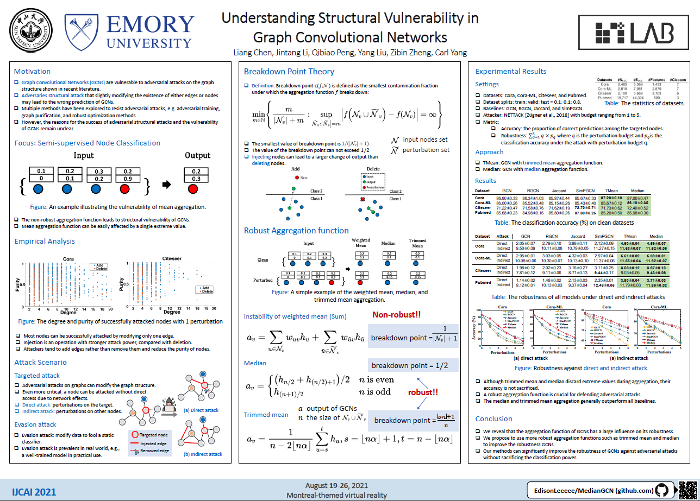

# MedianGCN
Official PyTorch implementation of MedianGCN and TrimmedGCN in Understanding Structural Vulnerability in Graph Convolutional Networks (IJCAI 2021). [[Paper]](https://www.ijcai.org/proceedings/2021/310)  [[Poster]](./poster.pdf) .

<p align="center">  <p align="center"><em>Fig. 1.  A simple example of the weighted mean, median, and trimmed mean aggregation. The trimmed mean discards the largest and smallest value.</em></p>

<p align="center">  <p align="center"><em>Fig. 2.  IJCAI 2021 Poster.</em></p>

These models are now also available our Pytorch-based repository [GraphGallery](https://github.com/EdisonLeeeee/GraphGallery), see:
+ `graphgallery.gallery.nodeclas.MedianGCN`
+ `graphgallery.gallery.nodeclas.TrimmedGCN`

Also, we provid the implementation with PyTorch Geometric (much faster) in [DeepRobust](https://github.com/DSE-MSU/DeepRobust), see:
+ [test_median_gcn](https://github.com/DSE-MSU/DeepRobust/blob/master/examples/graph/test_median_gcn.py)

## Requirements

+ torch>=1.4.0
+ graphgallery
```bash
git clone https://github.com/EdisonLeeeee/GraphGallery.git && cd GraphGallery
pip install -e . --verbose
```

## Usage
+ Performance of our methods compared to GCN before attack (on clean graph):
see `clean.ipynb`
+ Performance our methods compared to GCN under Nettack attack (on purtubed graph):
see `attack.ipynb`

## Cite
```bibtex
@inproceedings{chen2021understanding,
  title     = {Understanding Structural Vulnerability in Graph Convolutional Networks},
  author    = {Chen, Liang and Li, Jintang and Peng, Qibiao and Liu, Yang and Zheng, Zibin and Yang, Carl},
  booktitle = {IJCAI},
  publisher = {International Joint Conferences on Artificial Intelligence Organization},
  editor    = {Zhi-Hua Zhou},
  pages     = {2249--2255},
  year      = {2021},
  month     = {8},
  note      = {Main Track},
  doi       = {10.24963/ijcai.2021/310},
  url       = {https://doi.org/10.24963/ijcai.2021/310},
}
```

